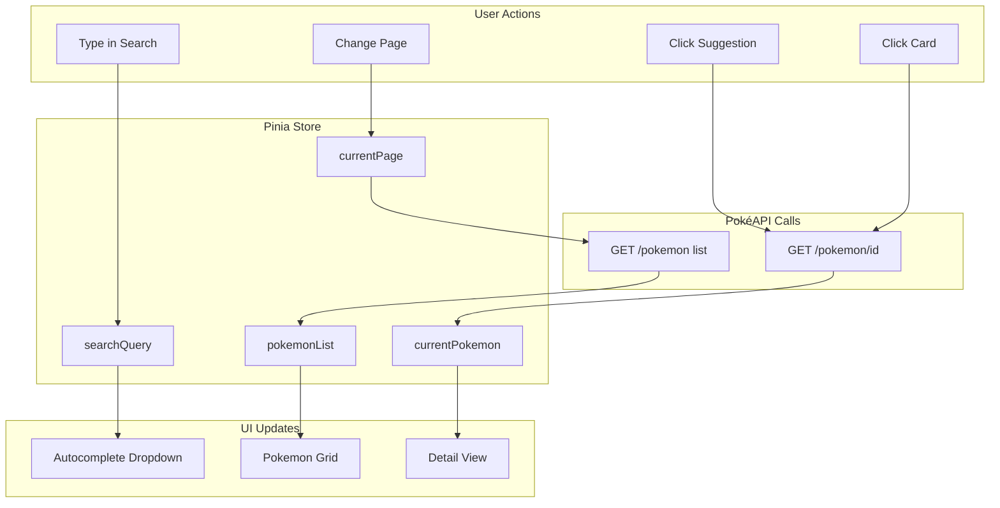
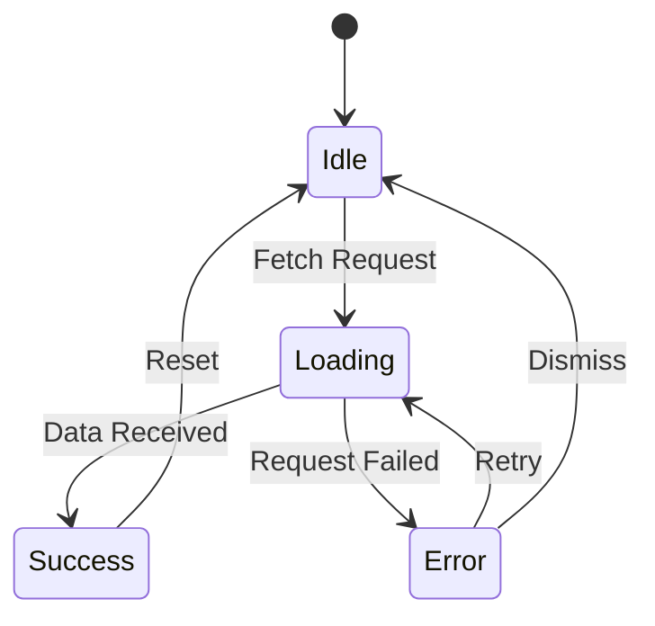

# PokéSearch - Product Requirements Document

## Table of Contents

1. [Project Overview](#1-project-overview)
2. [User Stories](#2-user-stories)
3. [UI Layout and Wireframes](#3-ui-layout-and-wireframes)
4. [Component Architecture](#4-component-architecture)
5. [State Management](#5-state-management)
6. [API Endpoints](#6-api-endpoints-pokéapi)
7. [Loading and Error States](#7-loading-and-error-states)
8. [Accessibility Considerations](#8-accessibility-a11y-considerations)
9. [Style Guide Implementation](#9-style-guide-implementation)
10. [Folder Structure](#10-folder-structure)
11. [GitHub Pages Deployment Plan](#11-github-pages-deployment-plan)
12. [Implementation Checklist](#12-implementation-checklist)

---

## 1. Project Overview

### Application Name

**PokéSearch** - A comprehensive web-based Pokémon search and discovery application.

### Description

PokéSearch allows users to discover and view detailed information about Pokémon using the PokéAPI. Users can search by name or ID, browse a paginated list, and view comprehensive details including stats, types, abilities, and sprites.

### Tech Stack

| Technology       | Purpose                                  |
| ---------------- | ---------------------------------------- |
| **Vue.js 3**     | Frontend framework (Composition API)     |
| **Vite**         | Build tool and dev server                |
| **Tailwind CSS** | Utility-first CSS framework              |
| **Pinia**        | State management                         |
| **Vue Router**   | Client-side routing                      |
| **PokéAPI**      | Data source (https://pokeapi.co/api/v2/) |

### Deployment Target

- **Platform:** GitHub Pages (static hosting)
- **URL Pattern:** `https://{username}.github.io/PokemonSearch/`

### Browser Support

- Chrome (latest 2 versions)
- Firefox (latest 2 versions)
- Safari (latest 2 versions)
- Edge (latest 2 versions)
- Mobile browsers (iOS Safari, Chrome for Android)

---

## 2. User Stories

### US-01: Search Pokémon by Name

**As a** user  
**I want to** search for a Pokémon by typing its name  
**So that** I can quickly find specific Pokémon I'm interested in

**Acceptance Criteria:**

- Search input is prominently displayed in the header
- Search is case-insensitive
- Partial matches trigger autocomplete suggestions
- Pressing Enter or clicking search executes the search
- Results display matching Pokémon cards

---

### US-02: Search Pokémon by ID

**As a** user  
**I want to** search for a Pokémon by its Pokédex number  
**So that** I can find Pokémon when I know their ID but not their name

**Acceptance Criteria:**

- Numeric input is accepted in the search field
- Valid IDs (1-1010+) return the corresponding Pokémon
- Invalid IDs show appropriate error message

---

### US-03: View Autocomplete Suggestions

**As a** user  
**I want to** see autocomplete suggestions as I type  
**So that** I can find Pokémon faster and discover names I might not remember exactly

**Acceptance Criteria:**

- Suggestions appear after typing 2+ characters
- Maximum of 8 suggestions displayed
- Suggestions are clickable and keyboard-navigable
- Suggestions show Pokémon name and ID
- Dropdown closes when clicking outside or pressing Escape

---

### US-04: Browse Pokémon List

**As a** user  
**I want to** browse through all Pokémon in a paginated grid  
**So that** I can discover Pokémon I might not know about

**Acceptance Criteria:**

- Home page displays a grid of Pokémon cards
- 20 Pokémon displayed per page
- Pagination controls at bottom of grid
- Current page indicator shown
- Previous/Next navigation buttons
- Option to jump to specific page

---

### US-05: View Pokémon Details

**As a** user  
**I want to** click on a Pokémon card to see detailed information  
**So that** I can learn everything about that Pokémon

**Acceptance Criteria:**

- Clicking a card opens detailed view (modal or page)
- Details include: name, ID, sprites (front/back, shiny variants)
- Stats displayed with visual bars (HP, Attack, Defense, etc.)
- Types shown with colored badges
- Abilities listed with descriptions
- Height and weight displayed
- Back/Close button to return to list

---

### US-06: Responsive Mobile Experience

**As a** mobile user  
**I want to** use the application on my phone  
**So that** I can search Pokémon anywhere

**Acceptance Criteria:**

- Layout adapts to screen sizes below 768px
- Cards stack in single or double column on mobile
- Touch-friendly tap targets (min 44x44px)
- Search bar remains accessible
- Navigation is thumb-friendly

---

### US-07: Handle Loading States

**As a** user  
**I want to** see loading indicators while data is being fetched  
**So that** I know the application is working

**Acceptance Criteria:**

- Skeleton cards shown while list loads
- Spinner shown when fetching Pokémon details
- Loading states are visually distinct but not jarring

---

### US-08: Handle Errors Gracefully

**As a** user  
**I want to** see helpful error messages when something goes wrong  
**So that** I understand the issue and know what to do

**Acceptance Criteria:**

- Network errors display user-friendly message
- "Pokémon not found" shows for invalid searches
- Retry button available for recoverable errors
- Error messages are clear and non-technical

---

### US-09: Keyboard Navigation

**As a** keyboard user  
**I want to** navigate the entire application using only my keyboard  
**So that** I can use the app without a mouse

**Acceptance Criteria:**

- All interactive elements are focusable
- Tab order is logical
- Enter activates buttons and links
- Escape closes modals/dropdowns
- Arrow keys navigate autocomplete suggestions

---

### US-10: Share Pokémon Link

**As a** user  
**I want to** share a direct link to a Pokémon's detail page  
**So that** I can show my friends specific Pokémon

**Acceptance Criteria:**

- Each Pokémon has a unique URL (e.g., `/pokemon/pikachu`)
- Direct links load the correct Pokémon
- URL updates when viewing different Pokémon

---

## 3. UI Layout and Wireframes

### 3.1 Overall Layout Structure

```
┌─────────────────────────────────────────────────────────────┐
│                         HEADER                               │
│  ┌──────────┐  ┌────────────────────────────────┐  ┌─────┐  │
│  │   LOGO   │  │         SEARCH BAR             │  │     │  │
│  └──────────┘  └────────────────────────────────┘  └─────┘  │
├─────────────────────────────────────────────────────────────┤
│                                                              │
│                         MAIN CONTENT                         │
│                                                              │
│   ┌─────────┐  ┌─────────┐  ┌─────────┐  ┌─────────┐       │
│   │ POKEMON │  │ POKEMON │  │ POKEMON │  │ POKEMON │       │
│   │  CARD   │  │  CARD   │  │  CARD   │  │  CARD   │       │
│   └─────────┘  └─────────┘  └─────────┘  └─────────┘       │
│                                                              │
│   ┌─────────┐  ┌─────────┐  ┌─────────┐  ┌─────────┐       │
│   │ POKEMON │  │ POKEMON │  │ POKEMON │  │ POKEMON │       │
│   │  CARD   │  │  CARD   │  │  CARD   │  │  CARD   │       │
│   └─────────┘  └─────────┘  └─────────┘  └─────────┘       │
│                                                              │
│              ┌─────────────────────────┐                    │
│              │      PAGINATION         │                    │
│              │   < 1 2 3 ... 50 >      │                    │
│              └─────────────────────────┘                    │
│                                                              │
├─────────────────────────────────────────────────────────────┤
│                         FOOTER                               │
│            Powered by PokéAPI | © 2026                      │
└─────────────────────────────────────────────────────────────┘
```

### 3.2 Header Component

```
┌─────────────────────────────────────────────────────────────┐
│                                                              │
│  ┌────────────┐    ┌──────────────────────────────────────┐ │
│  │  POKÉBALL  │    │ 🔍  Search Pokémon by name or ID... │ │
│  │    LOGO    │    └──────────────────────────────────────┘ │
│  │ PokéSearch │         │                                   │
│  └────────────┘         ▼ Autocomplete Dropdown             │
│                    ┌──────────────────────────────────────┐ │
│                    │  #25  Pikachu                        │ │
│                    │  #26  Raichu                         │ │
│                    │  #172 Pichu                          │ │
│                    └──────────────────────────────────────┘ │
└─────────────────────────────────────────────────────────────┘
```

### 3.3 Pokémon Card Component

```
┌─────────────────────────────┐
│          #025               │  <- Pokédex number
│    ┌─────────────────┐      │
│    │                 │      │
│    │   [SPRITE]      │      │  <- Official artwork or sprite
│    │                 │      │
│    └─────────────────┘      │
│                             │
│        PIKACHU              │  <- Name (capitalized)
│                             │
│   ┌──────────┐ ┌──────────┐ │
│   │ ELECTRIC │ │          │ │  <- Type badges (colored)
│   └──────────┘ └──────────┘ │
└─────────────────────────────┘
```

### 3.4 Pokémon Detail View

```
┌─────────────────────────────────────────────────────────────┐
│  ← Back                                              [X]    │
├─────────────────────────────────────────────────────────────┤
│                                                              │
│  ┌───────────────────┐    PIKACHU  #025                     │
│  │                   │                                       │
│  │                   │    Types: ┌──────────┐               │
│  │    [LARGE        │           │ ELECTRIC │               │
│  │     SPRITE]      │           └──────────┘               │
│  │                   │                                       │
│  │                   │    Height: 0.4m    Weight: 6.0kg     │
│  └───────────────────┘                                       │
│                                                              │
│  Sprite Variants:                                           │
│  ┌─────┐ ┌─────┐ ┌─────┐ ┌─────┐                           │
│  │Front│ │Back │ │Shiny│ │Shiny│                           │
│  │     │ │     │ │Front│ │Back │                           │
│  └─────┘ └─────┘ └─────┘ └─────┘                           │
│                                                              │
├─────────────────────────────────────────────────────────────┤
│  BASE STATS                                                  │
│                                                              │
│  HP          ████████████░░░░░░░░░░░░░░░░░░  35             │
│  Attack      ███████████████░░░░░░░░░░░░░░░  55             │
│  Defense     ████████████░░░░░░░░░░░░░░░░░░  40             │
│  Sp. Atk     ████████████████░░░░░░░░░░░░░░  50             │
│  Sp. Def     ████████████████░░░░░░░░░░░░░░  50             │
│  Speed       ██████████████████████░░░░░░░░  90             │
│                                                              │
├─────────────────────────────────────────────────────────────┤
│  ABILITIES                                                   │
│                                                              │
│  ┌─────────────────────────────────────────────────────┐    │
│  │ Static                                               │    │
│  │ May cause paralysis if touched.                     │    │
│  └─────────────────────────────────────────────────────┘    │
│  ┌─────────────────────────────────────────────────────┐    │
│  │ Lightning Rod (Hidden)                               │    │
│  │ Draws in Electric-type moves to raise Sp. Atk.      │    │
│  └─────────────────────────────────────────────────────┘    │
│                                                              │
└─────────────────────────────────────────────────────────────┘
```

### 3.5 Mobile Layout (< 768px)

```
┌─────────────────────┐
│      HEADER         │
│  ┌───────────────┐  │
│  │   POKÉBALL    │  │
│  │   PokéSearch  │  │
│  └───────────────┘  │
│  ┌───────────────┐  │
│  │ 🔍 Search...  │  │
│  └───────────────┘  │
├─────────────────────┤
│                     │
│  ┌───────────────┐  │
│  │  POKEMON      │  │
│  │  CARD         │  │
│  └───────────────┘  │
│                     │
│  ┌───────────────┐  │
│  │  POKEMON      │  │
│  │  CARD         │  │
│  └───────────────┘  │
│                     │
│  ┌───────────────┐  │
│  │  < 1 2 3 >    │  │
│  └───────────────┘  │
│                     │
├─────────────────────┤
│      FOOTER         │
└─────────────────────┘
```

---

## 4. Component Architecture

### 4.1 Component Tree

```
App.vue
├── AppHeader.vue
│   ├── Logo (inline SVG)
│   └── SearchBar.vue
│       └── AutocompleteDropdown.vue
├── RouterView
│   ├── HomeView.vue
│   │   ├── PokemonGrid.vue
│   │   │   └── PokemonCard.vue (×20)
│   │   │       └── PokemonTypeTag.vue (×1-2)
│   │   └── PaginationControls.vue
│   └── PokemonDetailView.vue
│       ├── PokemonDetail.vue
│       │   ├── PokemonTypeTag.vue (×1-2)
│       │   ├── PokemonStats.vue
│       │   └── AbilityCard.vue (×1-3)
│       └── LoadingSpinner.vue
├── ErrorMessage.vue (conditional)
└── AppFooter.vue
```

### 4.2 Component Specifications

#### AppHeader.vue

- **Purpose:** Main navigation and search interface
- **Props:** None
- **Events:** None (uses composables)
- **Contains:** Logo, SearchBar

#### SearchBar.vue

- **Purpose:** Text input with autocomplete for Pokémon search
- **Props:**
  - `placeholder: string` - Input placeholder text
- **Events:**
  - `@search(query: string)` - Emitted on search submit
- **State:**
  - `inputValue: string`
  - `showDropdown: boolean`
- **Features:**
  - Debounced input (300ms)
  - Keyboard navigation support

#### AutocompleteDropdown.vue

- **Purpose:** Display search suggestions
- **Props:**
  - `suggestions: Array<{name: string, id: number}>`
  - `isVisible: boolean`
  - `highlightedIndex: number`
- **Events:**
  - `@select(pokemon: {name, id})` - Suggestion selected

#### PokemonCard.vue

- **Purpose:** Display Pokémon preview in grid
- **Props:**
  - `pokemon: { id: number, name: string, types: Array, sprite: string }`
- **Events:**
  - `@click` - Navigate to detail view
- **Features:**
  - Hover animation
  - Lazy-loaded sprite

#### PokemonGrid.vue

- **Purpose:** Responsive grid container for cards
- **Props:**
  - `pokemon: Array<Pokemon>`
  - `isLoading: boolean`
- **Slots:**
  - `loading` - Custom loading state
  - `empty` - Custom empty state

#### PokemonDetail.vue

- **Purpose:** Full Pokémon information display
- **Props:**
  - `pokemon: PokemonDetail` (full API response)
- **Sections:**
  - Header (name, ID, types)
  - Sprite gallery
  - Stats visualization
  - Abilities list
  - Physical characteristics

#### PokemonStats.vue

- **Purpose:** Visual stat bars
- **Props:**
  - `stats: Array<{name: string, value: number}>`
- **Features:**
  - Animated bars on mount
  - Color-coded by stat type

#### PokemonTypeTag.vue

- **Purpose:** Colored type badge
- **Props:**
  - `type: string` (e.g., "electric", "fire")
- **Features:**
  - Dynamic background color based on type

#### PaginationControls.vue

- **Purpose:** Page navigation
- **Props:**
  - `currentPage: number`
  - `totalPages: number`
  - `maxVisiblePages: number` (default: 5)
- **Events:**
  - `@page-change(page: number)`

#### LoadingSpinner.vue

- **Purpose:** Loading indicator
- **Props:**
  - `size: 'sm' | 'md' | 'lg'` (default: 'md')
  - `text: string` (optional loading text)

#### ErrorMessage.vue

- **Purpose:** Error display with retry option
- **Props:**
  - `message: string`
  - `retryable: boolean`
- **Events:**
  - `@retry`

---

## 5. State Management

### 5.1 Store Structure (Pinia)

```javascript
// stores/pokemonStore.js

export const usePokemonStore = defineStore("pokemon", {
  state: () => ({
    // List State
    pokemonList: [], // Current page of Pokémon
    totalCount: 0, // Total Pokémon count from API
    currentPage: 1, // Current pagination page
    itemsPerPage: 20, // Items per page

    // Search State
    searchQuery: "", // Current search input
    allPokemonNames: [], // Cached list for autocomplete
    searchResults: [], // Filtered search results

    // Detail State
    currentPokemon: null, // Currently viewed Pokémon details

    // UI State
    isLoading: false, // Global loading flag
    isLoadingDetail: false, // Detail view loading flag
    error: null, // Error object/message

    // Cache
    pokemonCache: {}, // Cached Pokémon details by ID
  }),

  getters: {
    // Computed pagination info
    totalPages: (state) => Math.ceil(state.totalCount / state.itemsPerPage),
    offset: (state) => (state.currentPage - 1) * state.itemsPerPage,

    // Autocomplete suggestions
    autocompleteSuggestions: (state) => {
      if (state.searchQuery.length < 2) return [];
      const query = state.searchQuery.toLowerCase();
      return state.allPokemonNames
        .filter((p) => p.name.includes(query))
        .slice(0, 8);
    },

    // Check if Pokémon is cached
    isPokemonCached: (state) => (id) => !!state.pokemonCache[id],
  },

  actions: {
    // Fetch paginated list
    async fetchPokemonList(page = 1) {
      /* ... */
    },

    // Fetch single Pokémon details
    async fetchPokemonDetail(nameOrId) {
      /* ... */
    },

    // Initialize autocomplete cache
    async fetchAllPokemonNames() {
      /* ... */
    },

    // Search Pokémon
    async searchPokemon(query) {
      /* ... */
    },

    // Set current page
    setPage(page) {
      /* ... */
    },

    // Clear error
    clearError() {
      /* ... */
    },
  },
});
```

### 5.2 Composables

#### usePokemonSearch.js

```javascript
// Handles search logic and autocomplete
export function usePokemonSearch() {
  const store = usePokemonStore();
  const router = useRouter();

  const searchQuery = ref("");
  const showAutocomplete = ref(false);
  const highlightedIndex = ref(-1);

  // Debounced search input
  const debouncedQuery = useDebouncedRef(searchQuery, 300);

  // Watch and update store
  watch(debouncedQuery, (query) => {
    store.searchQuery = query;
  });

  // Handle search submit
  const handleSearch = async () => {
    /* ... */
  };

  // Handle suggestion select
  const handleSelect = (pokemon) => {
    /* ... */
  };

  // Keyboard navigation
  const handleKeydown = (event) => {
    /* ... */
  };

  return {
    searchQuery,
    showAutocomplete,
    highlightedIndex,
    suggestions: computed(() => store.autocompleteSuggestions),
    handleSearch,
    handleSelect,
    handleKeydown,
  };
}
```

#### usePokemonList.js

```javascript
// Handles list fetching and pagination
export function usePokemonList() {
  const store = usePokemonStore();

  // Fetch on mount
  onMounted(() => {
    if (store.pokemonList.length === 0) {
      store.fetchPokemonList();
    }
  });

  // Page change handler
  const goToPage = (page) => {
    store.setPage(page);
    store.fetchPokemonList(page);
  };

  return {
    pokemonList: computed(() => store.pokemonList),
    currentPage: computed(() => store.currentPage),
    totalPages: computed(() => store.totalPages),
    isLoading: computed(() => store.isLoading),
    error: computed(() => store.error),
    goToPage,
  };
}
```

#### usePokemonDetail.js

```javascript
// Handles detail fetching
export function usePokemonDetail(nameOrId) {
  const store = usePokemonStore();

  // Fetch on mount or param change
  watchEffect(() => {
    if (nameOrId.value) {
      store.fetchPokemonDetail(nameOrId.value);
    }
  });

  return {
    pokemon: computed(() => store.currentPokemon),
    isLoading: computed(() => store.isLoadingDetail),
    error: computed(() => store.error),
  };
}
```

### 5.3 State Flow Diagram



---

## 6. API Endpoints (PokéAPI)

### 6.1 Base URL

```
https://pokeapi.co/api/v2/
```

### 6.2 Endpoints Used

| Endpoint                        | Method | Purpose                      | Response                |
| ------------------------------- | ------ | ---------------------------- | ----------------------- |
| `/pokemon?limit={n}&offset={o}` | GET    | Paginated Pokémon list       | List with count         |
| `/pokemon/{name}`               | GET    | Pokémon by name              | Full Pokémon data       |
| `/pokemon/{id}`                 | GET    | Pokémon by ID                | Full Pokémon data       |
| `/pokemon-species/{id}`         | GET    | Species info                 | Descriptions, evolution |
| `/pokemon?limit=1500`           | GET    | All names (for autocomplete) | Complete list           |

### 6.3 Response Structures

#### List Response

```json
{
  "count": 1302,
  "next": "https://pokeapi.co/api/v2/pokemon?offset=20&limit=20",
  "previous": null,
  "results": [
    { "name": "bulbasaur", "url": "https://pokeapi.co/api/v2/pokemon/1/" },
    { "name": "ivysaur", "url": "https://pokeapi.co/api/v2/pokemon/2/" }
  ]
}
```

#### Pokémon Detail Response (Simplified)

```json
{
  "id": 25,
  "name": "pikachu",
  "height": 4,
  "weight": 60,
  "sprites": {
    "front_default": "url",
    "back_default": "url",
    "front_shiny": "url",
    "back_shiny": "url",
    "other": {
      "official-artwork": {
        "front_default": "url"
      }
    }
  },
  "stats": [
    { "base_stat": 35, "stat": { "name": "hp" } },
    { "base_stat": 55, "stat": { "name": "attack" } }
  ],
  "types": [{ "slot": 1, "type": { "name": "electric" } }],
  "abilities": [
    { "ability": { "name": "static" }, "is_hidden": false },
    { "ability": { "name": "lightning-rod" }, "is_hidden": true }
  ]
}
```

### 6.4 API Service Layer

```javascript
// services/pokeApiService.js

const BASE_URL = "https://pokeapi.co/api/v2";

export const pokeApiService = {
  // Fetch paginated list
  async getPokemonList(limit = 20, offset = 0) {
    const response = await fetch(
      `${BASE_URL}/pokemon?limit=${limit}&offset=${offset}`,
    );
    if (!response.ok) throw new Error("Failed to fetch Pokémon list");
    return response.json();
  },

  // Fetch single Pokémon
  async getPokemon(nameOrId) {
    const response = await fetch(
      `${BASE_URL}/pokemon/${nameOrId.toLowerCase()}`,
    );
    if (!response.ok) {
      if (response.status === 404) throw new Error("Pokémon not found");
      throw new Error("Failed to fetch Pokémon");
    }
    return response.json();
  },

  // Fetch species info (for descriptions)
  async getPokemonSpecies(id) {
    const response = await fetch(`${BASE_URL}/pokemon-species/${id}`);
    if (!response.ok) throw new Error("Failed to fetch species info");
    return response.json();
  },

  // Fetch all names for autocomplete (cached)
  async getAllPokemonNames() {
    const response = await fetch(`${BASE_URL}/pokemon?limit=1500`);
    if (!response.ok) throw new Error("Failed to fetch Pokémon names");
    const data = await response.json();
    return data.results.map((p, index) => ({
      name: p.name,
      id: index + 1,
    }));
  },
};
```

### 6.5 Rate Limiting Considerations

- PokéAPI has no authentication required
- Fair use policy: no explicit rate limit but be respectful
- Implement caching to reduce API calls
- Use batch fetching where possible

---

## 7. Loading and Error States

### 7.1 Loading States

#### Initial Page Load

- Display skeleton cards (gray placeholders with animation)
- Show subtle shimmer effect
- Maintain layout structure during load

#### Pokémon List Loading

```
┌─────────┐  ┌─────────┐  ┌─────────┐  ┌─────────┐
│░░░░░░░░░│  │░░░░░░░░░│  │░░░░░░░░░│  │░░░░░░░░░│
│░░░░░░░░░│  │░░░░░░░░░│  │░░░░░░░░░│  │░░░░░░░░░│
│░░░░░░░░░│  │░░░░░░░░░│  │░░░░░░░░░│  │░░░░░░░░░│
│░░░░░░░░░│  │░░░░░░░░░│  │░░░░░░░░░│  │░░░░░░░░░│
└─────────┘  └─────────┘  └─────────┘  └─────────┘
```

#### Detail View Loading

- Centered spinner with "Loading Pokémon..." text
- Blurred/dimmed background if transitioning from list

#### Search Loading

- Small spinner in search input
- Autocomplete shows "Searching..." placeholder

### 7.2 Error States

#### Network Error

```
┌─────────────────────────────────────────────────────┐
│                                                      │
│              ⚠️  Connection Error                   │
│                                                      │
│     Unable to reach the Pokémon database.           │
│     Please check your internet connection.          │
│                                                      │
│              ┌─────────────────┐                    │
│              │   Try Again     │                    │
│              └─────────────────┘                    │
│                                                      │
└─────────────────────────────────────────────────────┘
```

#### Pokémon Not Found

```
┌─────────────────────────────────────────────────────┐
│                                                      │
│                 🔍  Not Found                       │
│                                                      │
│     No Pokémon matches "chaarzard"                  │
│     Did you mean "charizard"?                       │
│                                                      │
│              ┌─────────────────┐                    │
│              │  Search Again   │                    │
│              └─────────────────┘                    │
│                                                      │
└─────────────────────────────────────────────────────┘
```

#### Empty Search Results

```
┌─────────────────────────────────────────────────────┐
│                                                      │
│                 No Results                          │
│                                                      │
│     No Pokémon found for "xyz123"                   │
│     Try searching with a different term.           │
│                                                      │
└─────────────────────────────────────────────────────┘
```

### 7.3 State Transitions



---

## 8. Accessibility (a11y) Considerations

### 8.1 WCAG 2.1 AA Compliance Targets

#### Perceivable

- **1.1.1 Non-text Content:** All images have alt text
- **1.3.1 Info and Relationships:** Semantic HTML structure
- **1.4.1 Use of Color:** Information not conveyed by color alone
- **1.4.3 Contrast:** 4.5:1 minimum for normal text
- **1.4.4 Resize Text:** Supports up to 200% zoom

#### Operable

- **2.1.1 Keyboard:** All functionality accessible via keyboard
- **2.1.2 No Keyboard Trap:** Focus can always be moved
- **2.4.1 Bypass Blocks:** Skip to main content link
- **2.4.3 Focus Order:** Logical tab sequence
- **2.4.7 Focus Visible:** Clear focus indicators

#### Understandable

- **3.1.1 Language:** `lang="en"` on HTML element
- **3.2.1 On Focus:** No unexpected context changes
- **3.3.1 Error Identification:** Errors clearly described

#### Robust

- **4.1.1 Parsing:** Valid HTML
- **4.1.2 Name, Role, Value:** ARIA labels where needed

### 8.2 Implementation Checklist

#### Semantic HTML

```html
<header role="banner">
  <nav aria-label="Main navigation">...</nav>
</header>

<main id="main-content" role="main">
  <h1>Pokémon Search</h1>
  <section aria-label="Search">...</section>
  <section aria-label="Pokémon Grid">...</section>
</main>

<footer role="contentinfo">...</footer>
```

#### Skip Link

```html
<a href="#main-content" class="skip-link"> Skip to main content </a>
```

#### Search Input

```html
<label for="pokemon-search" class="sr-only"> Search for a Pokémon </label>
<input
  id="pokemon-search"
  type="search"
  role="combobox"
  aria-expanded="false"
  aria-controls="autocomplete-list"
  aria-autocomplete="list"
  placeholder="Search Pokémon..."
/>
<ul id="autocomplete-list" role="listbox" aria-label="Search suggestions">
  <li role="option" aria-selected="false">...</li>
</ul>
```

#### Pokémon Card

```html
<article
  class="pokemon-card"
  tabindex="0"
  role="button"
  aria-label="View details for Pikachu, number 25"
>
  
  <h2>Pikachu</h2>
  <span class="type-tag" aria-label="Electric type"> Electric </span>
</article>
```

#### Modal/Dialog

```html
<div role="dialog" aria-modal="true" aria-labelledby="pokemon-detail-title">
  <h2 id="pokemon-detail-title">Pikachu Details</h2>
  <button aria-label="Close dialog">×</button>
  ...
</div>
```

### 8.3 Focus Management

1. **Route Changes:** Focus main heading on navigation
2. **Modal Open:** Focus first focusable element in modal
3. **Modal Close:** Return focus to triggering element
4. **Autocomplete:** Arrow keys navigate options
5. **Pagination:** Focus first card after page change

### 8.4 Screen Reader Announcements

```javascript
// Live region for dynamic content
<div role="status" aria-live="polite" aria-atomic="true" class="sr-only">
  {{ announcement }}
</div>;

// Announce loading
("Loading Pokémon...");

// Announce results
("Found 20 Pokémon. Page 1 of 50.");

// Announce errors
("Error: Could not load Pokémon. Please try again.");
```

---

## 9. Style Guide Implementation

### 9.1 Color Palette

| Color Name       | Hex Code  | Usage                        |
| ---------------- | --------- | ---------------------------- |
| Primary (Yellow) | `#FFCB05` | Buttons, highlights, accents |
| Secondary (Blue) | `#3D7DCA` | Links, secondary buttons     |
| Accent (Red)     | `#CC0000` | Errors, Pokéball accent      |
| Text Dark        | `#2A2A2A` | Primary text                 |
| Text Light       | `#6B7280` | Secondary text               |
| Background       | `#F3F4F6` | Page background              |
| Card White       | `#FFFFFF` | Card backgrounds             |
| Border           | `#E5E7EB` | Card borders                 |

### 9.2 Pokémon Type Colors

```javascript
const typeColors = {
  normal: "#A8A878",
  fire: "#F08030",
  water: "#6890F0",
  electric: "#F8D030",
  grass: "#78C850",
  ice: "#98D8D8",
  fighting: "#C03028",
  poison: "#A040A0",
  ground: "#E0C068",
  flying: "#A890F0",
  psychic: "#F85888",
  bug: "#A8B820",
  rock: "#B8A038",
  ghost: "#705898",
  dragon: "#7038F8",
  dark: "#705848",
  steel: "#B8B8D0",
  fairy: "#EE99AC",
};
```

### 9.3 Typography

```css
/* Font Import (index.css) */
@import url("https://fonts.googleapis.com/css2?family=Poppins:wght@400;500;600;700&display=swap");

/* Base font */
font-family: "Poppins", sans-serif;

/* Scale */
text-xs: 0.75rem; /* 12px - labels */
text-sm: 0.875rem; /* 14px - secondary text */
text-base: 1rem; /* 16px - body text */
text-lg: 1.125rem; /* 18px - large text */
text-xl: 1.25rem; /* 20px - card titles */
text-2xl: 1.5rem; /* 24px - section headers */
text-3xl: 1.875rem; /* 30px - page titles */
text-4xl: 2.25rem; /* 36px - hero text */
```

### 9.4 Tailwind Configuration

```javascript
// tailwind.config.js
export default {
  content: ["./index.html", "./src/**/*.{vue,js,ts,jsx,tsx}"],
  theme: {
    extend: {
      colors: {
        pokemon: {
          yellow: "#FFCB05",
          blue: "#3D7DCA",
          red: "#CC0000",
        },
        type: {
          normal: "#A8A878",
          fire: "#F08030",
          water: "#6890F0",
          electric: "#F8D030",
          grass: "#78C850",
          ice: "#98D8D8",
          fighting: "#C03028",
          poison: "#A040A0",
          ground: "#E0C068",
          flying: "#A890F0",
          psychic: "#F85888",
          bug: "#A8B820",
          rock: "#B8A038",
          ghost: "#705898",
          dragon: "#7038F8",
          dark: "#705848",
          steel: "#B8B8D0",
          fairy: "#EE99AC",
        },
      },
      fontFamily: {
        poppins: ["Poppins", "sans-serif"],
      },
      boxShadow: {
        card: "0 2px 8px rgba(0, 0, 0, 0.1)",
        "card-hover": "0 8px 24px rgba(0, 0, 0, 0.15)",
      },
    },
  },
  plugins: [],
};
```

### 9.5 Component Styling Patterns

#### Card Hover Effect

```html
<div
  class="
  bg-white 
  rounded-xl 
  shadow-card 
  hover:shadow-card-hover 
  transform 
  hover:-translate-y-1 
  transition-all 
  duration-200
"
></div>
```

#### Primary Button

```html
<button
  class="
  bg-pokemon-yellow 
  hover:bg-yellow-400 
  text-gray-900 
  font-semibold 
  px-6 
  py-2 
  rounded-full 
  transition-colors
"
></button>
```

#### Type Tag

```html
<span
  class="
  px-3 
  py-1 
  rounded-full 
  text-white 
  text-sm 
  font-medium
  bg-type-electric
"
>
  Electric
</span>
```

---

## 10. Folder Structure

```
PokemonSearch/
├── .github/
│   └── workflows/
│       └── deploy.yml          # GitHub Actions deployment
├── public/
│   ├── favicon.ico             # Pokéball favicon
│   └── 404.html                # SPA fallback for GitHub Pages
├── src/
│   ├── assets/
│   │   ├── logo.svg            # PokéSearch logo
│   │   └── pokeball.svg        # Pokéball icon
│   ├── components/
│   │   ├── layout/
│   │   │   ├── AppHeader.vue
│   │   │   └── AppFooter.vue
│   │   ├── search/
│   │   │   ├── SearchBar.vue
│   │   │   └── AutocompleteDropdown.vue
│   │   ├── pokemon/
│   │   │   ├── PokemonCard.vue
│   │   │   ├── PokemonGrid.vue
│   │   │   ├── PokemonDetail.vue
│   │   │   ├── PokemonStats.vue
│   │   │   ├── PokemonTypeTag.vue
│   │   │   └── AbilityCard.vue
│   │   └── common/
│   │       ├── LoadingSpinner.vue
│   │       ├── SkeletonCard.vue
│   │       ├── ErrorMessage.vue
│   │       └── PaginationControls.vue
│   ├── composables/
│   │   ├── usePokemonSearch.js
│   │   ├── usePokemonList.js
│   │   ├── usePokemonDetail.js
│   │   └── useDebouncedRef.js
│   ├── stores/
│   │   └── pokemonStore.js
│   ├── services/
│   │   └── pokeApiService.js
│   ├── router/
│   │   └── index.js
│   ├── views/
│   │   ├── HomeView.vue
│   │   └── PokemonDetailView.vue
│   ├── utils/
│   │   ├── formatters.js       # Name capitalization, etc.
│   │   └── constants.js        # Type colors, stat names
│   ├── App.vue
│   ├── main.js
│   └── index.css               # Tailwind directives + global styles
├── index.html
├── package.json
├── vite.config.js
├── tailwind.config.js
├── postcss.config.js
├── .gitignore
└── README.md
```

### File Descriptions

| File/Folder                    | Purpose                                      |
| ------------------------------ | -------------------------------------------- |
| `.github/workflows/deploy.yml` | Automated deployment to GitHub Pages         |
| `public/404.html`              | Handles client-side routing on GitHub Pages  |
| `src/components/`              | Reusable Vue components organized by feature |
| `src/composables/`             | Vue 3 Composition API logic extraction       |
| `src/stores/`                  | Pinia state management                       |
| `src/services/`                | API communication layer                      |
| `src/router/`                  | Vue Router configuration                     |
| `src/views/`                   | Page-level components                        |
| `src/utils/`                   | Helper functions and constants               |

---

## 11. GitHub Pages Deployment Plan

### 11.1 Prerequisites

- GitHub repository created
- Code pushed to `main` branch
- GitHub Pages enabled in repository settings

### 11.2 Vite Configuration

```javascript
// vite.config.js
import { defineConfig } from "vite";
import vue from "@vitejs/plugin-vue";

export default defineConfig({
  plugins: [vue()],
  base: "/PokemonSearch/", // Repository name
  build: {
    outDir: "dist",
  },
});
```

### 11.3 GitHub Actions Workflow

```yaml
# .github/workflows/deploy.yml
name: Deploy to GitHub Pages

on:
  push:
    branches: [main]
  workflow_dispatch:

permissions:
  contents: read
  pages: write
  id-token: write

concurrency:
  group: pages
  cancel-in-progress: true

jobs:
  build:
    runs-on: ubuntu-latest
    steps:
      - name: Checkout
        uses: actions/checkout@v4

      - name: Setup Node
        uses: actions/setup-node@v4
        with:
          node-version: 20
          cache: npm

      - name: Install dependencies
        run: npm ci

      - name: Build
        run: npm run build

      - name: Setup Pages
        uses: actions/configure-pages@v4

      - name: Upload artifact
        uses: actions/upload-pages-artifact@v3
        with:
          path: ./dist

  deploy:
    environment:
      name: github-pages
      url: ${{ steps.deployment.outputs.page_url }}
    runs-on: ubuntu-latest
    needs: build
    steps:
      - name: Deploy to GitHub Pages
        id: deployment
        uses: actions/deploy-pages@v4
```

### 11.4 SPA Routing Fix (404.html)

```html
<!-- public/404.html -->
<!DOCTYPE html>
<html>
  <head>
    <meta charset="utf-8" />
    <title>PokéSearch</title>
    <script>
      // Redirect to index with path preserved
      const path = window.location.pathname;
      const repo = "/PokemonSearch";
      if (path.startsWith(repo)) {
        const route = path.slice(repo.length) || "/";
        sessionStorage.setItem("redirect", route);
        window.location.replace(repo + "/");
      }
    </script>
  </head>
  <body></body>
</html>
```

```javascript
// In main.js - handle redirect
const redirect = sessionStorage.getItem("redirect");
if (redirect) {
  sessionStorage.removeItem("redirect");
  router.replace(redirect);
}
```

### 11.5 Deployment Steps

1. **Initial Setup**
   - Create GitHub repository
   - Push code to `main` branch
   - Go to Settings > Pages
   - Source: GitHub Actions

2. **Automatic Deployment**
   - Every push to `main` triggers deployment
   - Build runs (~2-3 minutes)
   - Site available at `https://{username}.github.io/PokemonSearch/`

3. **Manual Deployment**
   - Go to Actions tab
   - Select "Deploy to GitHub Pages"
   - Click "Run workflow"

### 11.6 Environment Variables

- No environment variables required (PokéAPI is public)
- If needed in future, use GitHub Secrets

---

## 12. Implementation Checklist

See separate document: [IMPLEMENTATION_CHECKLIST.md](./IMPLEMENTATION_CHECKLIST.md)

---

## Appendix A: Pokémon Stat Formulas

For stat bar visualization:

- Maximum base stat value: 255 (used as 100% width)
- Stat bar percentage: `(stat / 255) * 100`

## Appendix B: Sprite URLs

```javascript
// Official artwork (high quality)
`https://raw.githubusercontent.com/PokeAPI/sprites/master/sprites/pokemon/other/official-artwork/${id}.png`
// Default sprite (small)
`https://raw.githubusercontent.com/PokeAPI/sprites/master/sprites/pokemon/${id}.png`
// Shiny variant
`https://raw.githubusercontent.com/PokeAPI/sprites/master/sprites/pokemon/shiny/${id}.png`;
```

## Appendix C: Glossary

| Term           | Definition                                    |
| -------------- | --------------------------------------------- |
| **Pokédex**    | Encyclopedia of Pokémon                       |
| **Sprite**     | Small 2D image of a Pokémon                   |
| **Base Stats** | Numerical values defining Pokémon strength    |
| **Ability**    | Special power a Pokémon can have              |
| **Type**       | Category that determines strengths/weaknesses |

---

_Document Version: 1.0_  
_Last Updated: January 2026_  
_Author: PokéSearch Development Team_
